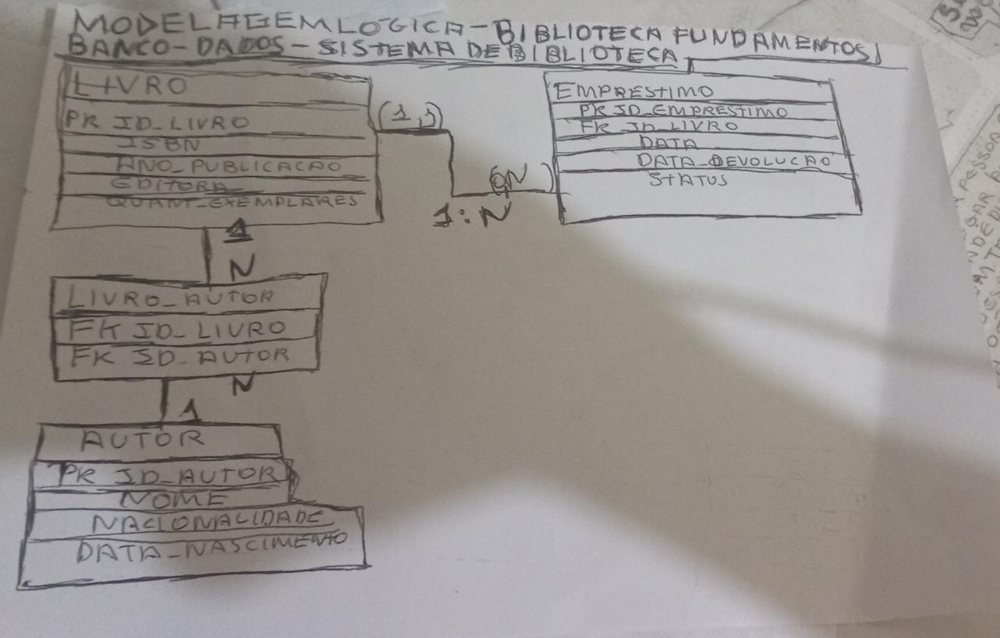

# Modelagem Lógica

## 1. Objetivo

Este documento apresenta a modelagem lógica do Sistema de Biblioteca, elaborada a partir da modelagem conceitual desenvolvida na etapa anterior.

O objetivo desta etapa é transformar as entidades, atributos e relacionamentos definidos no Diagrama Entidade-Relacionamento (DER) em uma estrutura lógica composta por tabelas, preparando o banco de dados para sua futura implementação em um Sistema Gerenciador de Banco de Dados (SGBD).

---

# 2. Objetivos da Modelagem Lógica

Nesta etapa foram realizadas as seguintes atividades:

* Conversão das entidades em tabelas.
* Definição das chaves primárias (Primary Key - PK).
* Definição das chaves estrangeiras (Foreign Key - FK).
* Conversão dos relacionamentos da modelagem conceitual para o modelo lógico.
* Organização da estrutura do banco de dados de acordo com o modelo relacional.

---

# 3. Tabelas do Sistema

O sistema é composto pelas seguintes tabelas:

## Livro

Representa os livros cadastrados na biblioteca.

### Atributos

* id_livro (PK)
* isbn
* ano_publicacao
* editora
* quantidade_exemplares

---

## Autor

Representa os autores responsáveis pelas obras cadastradas.

### Atributos

* id_autor (PK)
* nome
* nacionalidade
* data_nascimento

---

## Empréstimo

Representa o registro dos empréstimos realizados pela biblioteca.

### Atributos

* id_emprestimo (PK)
* data_emprestimo
* data_prevista_devolucao
* data_devolucao
* status

---

# 4. Relacionamentos

Durante a modelagem lógica foram considerados os seguintes relacionamentos:

## Autor ↔ Livro

* Relacionamento do tipo N:N.
* Um autor pode escrever vários livros.
* Um livro pode possuir vários autores.

Este relacionamento será convertido para o modelo relacional utilizando uma tabela intermediária na etapa de implementação lógica completa.

---

## Livro ↔ Empréstimo

* Relacionamento do tipo 1:N.
* Um livro pode participar de vários empréstimos ao longo do tempo.
* Cada empréstimo está associado a um único livro.

---

# 5. Chaves

## Chaves Primárias (PK)

Cada tabela possui uma chave primária responsável por identificar unicamente cada registro.

* Livro → id_livro
* Autor → id_autor
* Empréstimo → id_emprestimo

---

## Chaves Estrangeiras (FK)

As chaves estrangeiras serão utilizadas para representar os relacionamentos entre as tabelas durante a implementação do banco de dados.

---

# 6. Diagrama da Modelagem Lógica

A figura abaixo apresenta a representação gráfica da modelagem lógica desenvolvida para o Sistema de Biblioteca.

> Inserir nesta seção a imagem do Modelo Lógico.

Exemplo:

---

# 7. Conclusão

A modelagem lógica representa a estrutura relacional do banco de dados, servindo como etapa intermediária entre a modelagem conceitual e a implementação física.

Com esta modelagem é possível visualizar como as tabelas serão organizadas, como os dados serão relacionados e quais chaves serão utilizadas para garantir a integridade das informações antes da criação das instruções SQL.
